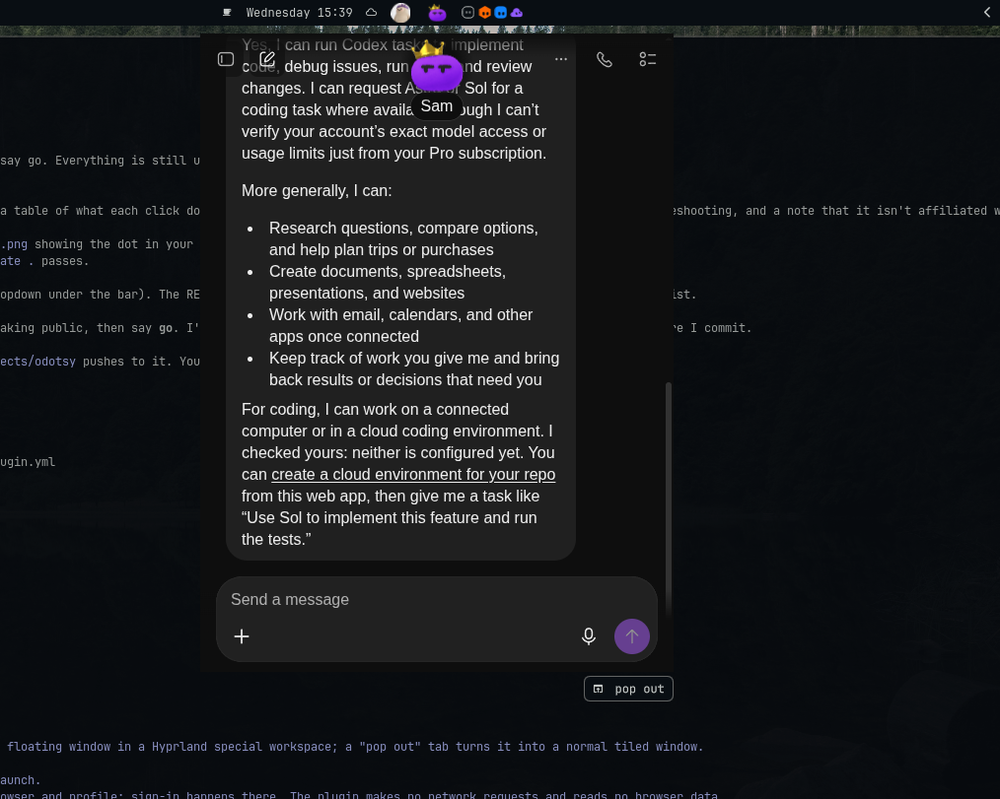
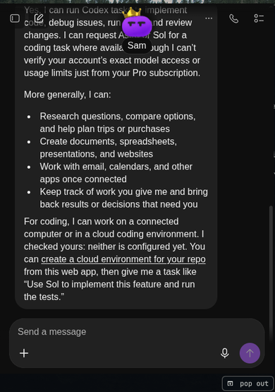
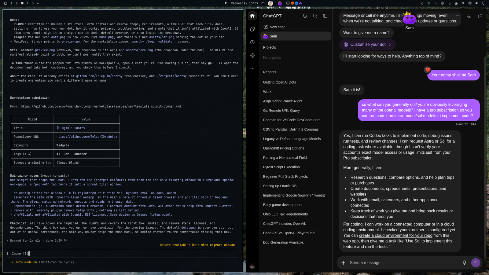

# Odotsy

**[ChatGPT Dots](https://chatgpt.com/dots/home) in the [Omarchy](https://omarchy.org) bar.** Click your dot and your Dots chat drops down from the top of the screen. Click again and it tucks away, still loaded, right where you left it.



No new window to manage, no tab to find. When you do want a full window, the `pop out` tab under the dropdown's corner turns it into one.

## Install

```sh
omarchy plugin add https://github.com/telep-io/odotsy.git --enable
omarchy restart shell
```

That's it. The widget lands in the center of the bar; move it with `omarchy bar move telep.dots --section right` (or `left`).

The first click opens ChatGPT Dots as an Omarchy web app in your default browser, using your normal browser profile. If you are already signed in to chatgpt.com there, you land straight in Dots. If not, sign in once in that window, like on any other site. After that your dot is one click away.

### Requirements

Everything below ships with Omarchy; there is nothing extra to install.

- Omarchy Quattro (the Quickshell-based shell, Hyprland with Lua config)
- A Chromium-based default browser (Chromium, Brave, Chrome...) for the web app window
- `jq`
- A ChatGPT account with access to Dots

### Remove

```sh
omarchy plugin remove telep.dots
```

It leaves nothing behind: no config edits, no state files, no services.

## Use


| Action | Result |
|---|---|
| Click the dot | Drop the chat down, or tuck it away |
| Click `pop out` (just below the dropdown's bottom-right corner) | Turn the dropdown into a normal tiled window on the current workspace |
| Click the dot while popped out | Focus that window |
| Close the popped-out window, then click the dot | A fresh dropdown |

The dropdown opens on whichever monitor you clicked, centered under the dot. Tucked away, Dots keeps running, so a reply that was streaming is finished when you come back.



Popped out, it is the full ChatGPT web app in a normal tiled window:



## Settings

Set from the bar's widget settings, or from a terminal:

```sh
omarchy bar set telep.dots width 560             # dropdown width in px, 360-1200 (default 480)
omarchy bar set telep.dots heightPercent 70      # dropdown height, % of the screen, 30-90 (default 60)
omarchy bar set telep.dots avatar ~/Pictures/my-dot.png
omarchy bar set telep.dots url https://chatgpt.com/dots/<your-dot-id>
```

Size and URL changes apply the next time the dropdown opens (close a running Dots window first for a new URL).

### Your own dot

Out of the box the bar shows a purple dot, and the dropdown opens `chatgpt.com/dots/home`, which takes you to your dot. To make it yours:

1. Save a picture of your dot as a square PNG (transparent corners if you want it round) and run `omarchy bar set telep.dots avatar /path/to/it.png`.
2. Optionally, open your dot in the browser, copy the `chatgpt.com/dots/<id>` address, and run `omarchy bar set telep.dots url <that address>` to skip the home page.

The plugin cannot see your ChatGPT account, so it does not pick your dot up by itself or follow changes to it. If you customize your dot, save the image again.

## How it works

Dots has no public API and the Omarchy shell cannot host a web view, so the dropdown *is* the real ChatGPT Dots web app: a borderless floating browser window parked in a Hyprland special workspace named `dots`. Toggling a special workspace slides it in from the top, which is the whole animation.

| File | Job |
|---|---|
| `BarWidget.qml` | Draws the dot, works out where the dropdown goes, listens for Hyprland's `activespecial` event, and shows the `pop out` tab while the dropdown is down |
| `bin/dots-toggle` | Registers a named runtime window rule with `hyprctl eval`, launches the web app with `omarchy-launch-webapp`, toggles the workspace, and handles pop-out |
| `dots.png` | The default bar icon |

The window is matched by its web app class (`chatgpt.com__dots`), so a regular ChatGPT web app window is left alone. The window rule is registered at runtime, every launch, so the plugin never edits your Hyprland config and a config reload cannot break it.

## Privacy

The plugin makes no network requests and reads no browser data. Everything you type goes to chatgpt.com through your own browser, exactly as if you had opened the site yourself. Like every Omarchy plugin it runs unsandboxed with your user permissions; it is about 150 lines, so have a read.

## Troubleshooting

- **Click focuses a normal window instead of dropping down.** A Dots window is already open somewhere (popped out, or opened by hand). Close it and click the dot again.
- **Nothing happens on click.** Run `~/.config/omarchy/plugins/telep.dots/bin/dots-toggle` in a terminal and read the error; the usual cause is no Chromium-based default browser.
- **The dropdown shows a login page.** You are not signed in to chatgpt.com in your default browser. Sign in inside the dropdown once.
- **The widget is missing after install.** `omarchy-shell shell rescanPlugins`, then `omarchy plugin enable telep.dots`.

## Not affiliated

ChatGPT and Dots are OpenAI products. This is an unofficial launcher for the public ChatGPT web app, not affiliated with or endorsed by OpenAI.

## License

[MIT](LICENSE)
